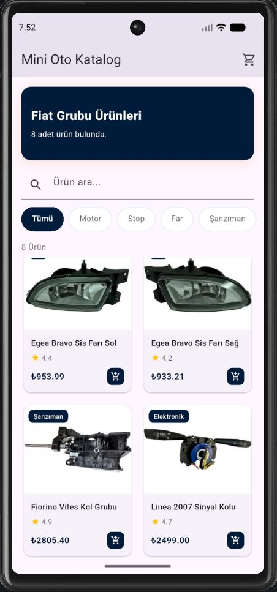
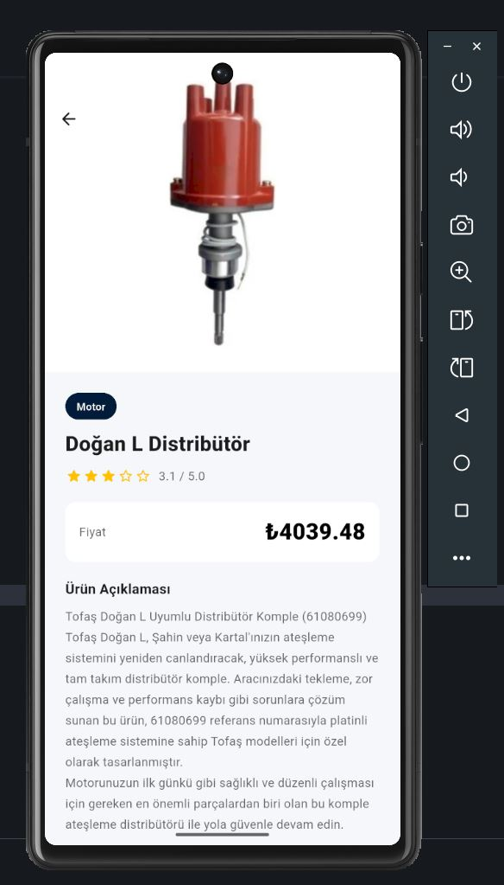
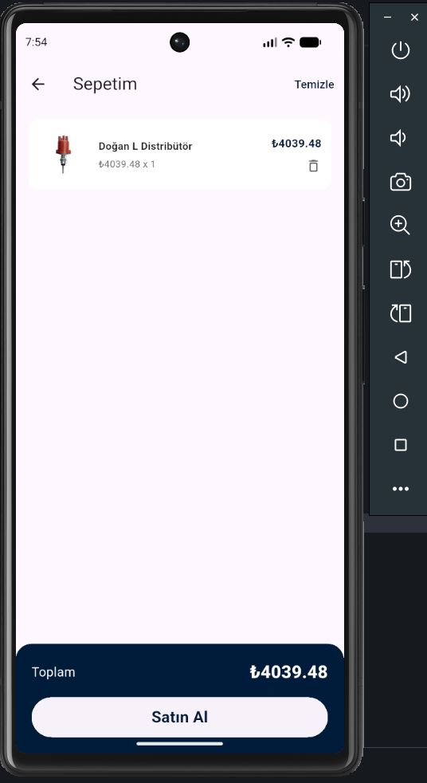

# 🚗 Mini Oto Katalog — Flutter Staj Projesi

---

## 📱 Proje Hakkında

**Mini Oto Katalog**, Flutter eğitimi kapsamında geliştirilmiş bir mobil katalog uygulamasıdır.  
Uygulama; otomotiv yedek parçalarının listelenmesi, kategoriye göre filtrelenmesi, ürün detaylarının görüntülenmesi ve temel sepet işlemlerinin simülasyonu amacıyla hazırlanmıştır.

Bu proje ile:
- Flutter widget yapısı
- Sayfalar arası geçiş
- GridView kullanımı
- JSON veri yönetimi
- Stateful yapı mantığı
- Modern mobil arayüz tasarımı

konularının uygulamalı olarak geliştirilmesi hedeflenmiştir.

---

## ✨ Özellikler

| Özellik | Açıklama |
|---|---|
| Ana Sayfa | Banner alanı, arama kutusu ve ürün listeleme |
| Ürün Arama | Gerçek zamanlı filtreleme |
| Kategori Sistemi | Kategoriye göre ürün listeleme |
| Ürün Detay Ekranı | Ürün açıklaması, fiyat ve görsel gösterimi |
| Sepet Simülasyonu | Ürün ekleme ve toplam fiyat hesaplama |
| Modern Tema | Otomotiv odaklı özel renk paleti |
| JSON Veri Yapısı | Ürünlerin JSON formatında yönetimi |

---

## 🗂️ Proje Klasör Yapısı

```text
lib/
├── main.dart
│
├── models/
│   ├── product.dart
│   ├── cart.dart
│   └── auto_product_service.dart
│
├── screens/
│   ├── home_screen.dart
│   ├── product_detail_screen.dart
│   └── cart_screen.dart
│
├── widgets/
│   ├── product_card.dart
│   └── category_filter.dart
│
└── theme/
    └── app_theme.dart

assets/
├── data/
│   └── products.json
│
├── icon/
│   └── app_icon.png
│
└── ss/
    ├── Screenshot1.JPG
    ├── Screenshot2.JPG
    └── Screenshot3.JPG

android/
├── app/
│   ├── src/
│   ├── build.gradle.kts
│   └── AndroidManifest.xml
│
└── gradle/
```

---

## 🛠️ Kullanılan Teknolojiler

- Flutter SDK
- Dart SDK
- Material Design
- JSON Data Structure
- GridView
- Stateful Widget

---

## 🛠️ Flutter Sürümü

- Flutter SDK: 3.41.9
- Dart SDK: 3.11.5
- DevTools: 2.54.2

---

## ⚙️ Gereksinimler

- Flutter SDK kurulu olmalıdır
- Android Studio veya Visual Studio Code
- Android Emulator veya fiziksel Android cihaz

---

## 🚀 Kurulum ve Çalıştırma

Projeyi klonlayın:

```text
git clone https://github.com/Furk4nn/mini-oto-katalog
cd mini_katalog_furkan
```

Bağımlılıkları yükleyin:

```text
flutter pub get
```

Projeyi çalıştırın:

```text
flutter run
```

---

## 🖼️ Uygulama Görselleri

<p align="center">
  
  
  
</p>

---

## 📌 Proje İçeriği

Bu proje eğitim ve portfolyo amacıyla geliştirilmiştir.  
Gerçek bir e-ticaret altyapısı içermez. Ürün verileri eğitim amaçlı örnek katalog verisi olarak kullanılmıştır.

---

